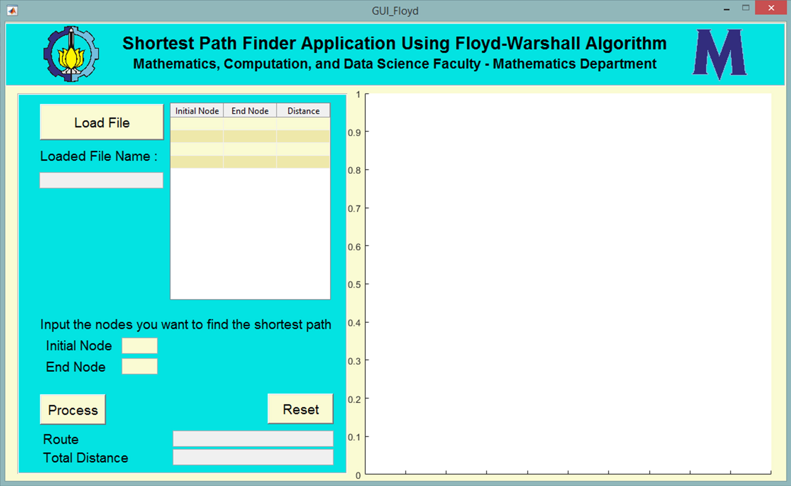
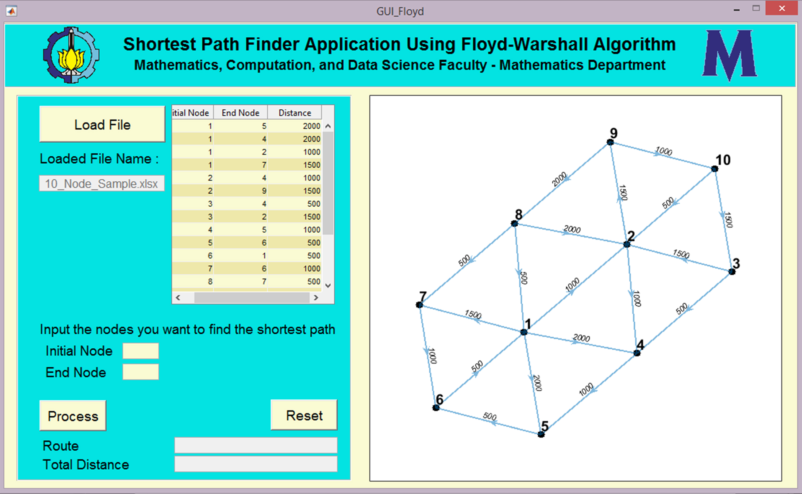
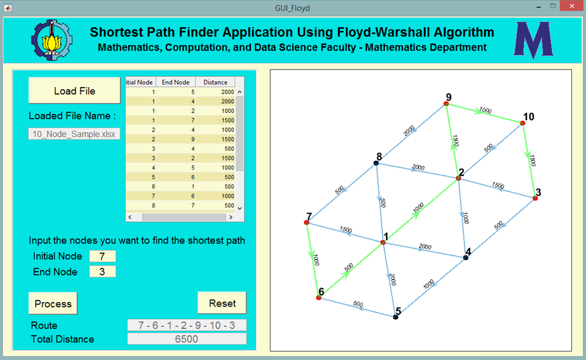

# Description 
This is my big project for course **PLM** / **Mathematical Software** at 4th semester. This project is a mathematical implementation to find the shortest path from the starting point to the end point. The algorithm used in this project is Floyd Warshall.

## Detail GUI
 
* Buttons:
    1. `Load File`: button to load excel file that represent Direted Graph.
    2. `Process`: To proces shortest path from initial node to end node.
    3. `Reset`: To clear all result.
* Text Box:
    1. **Initial Node**: to input initial node.
    2. **End Node**: to input end node.
* White box in the right side: to plot directed graph and the result shortest path

## Input-Output
* Input  : Directed graph $G=(N,E)$, consisting of the set $N$ of nodes and the set $E$ of edges, which are ordered pairs of elements of $N$. Then, initial node and end node to find the shortest distance.
* Output : The order of the shortest path and its total distances.

## How to Use:
1. Click `Load File` button to load excel file.
2. The file name will appear to ensure that the file that loaded is correct.
3. Visualization of graph also will appear at the right side.

4. Input **initial node** and **End node** correctly
5. Click `Process` button to find the path and the total distances
6. The result will appear at **Route** and **Total Distance**.
7. The graph visualization will be updated according to the input node and results

8. Click `Reset` to clear all and reset current result
